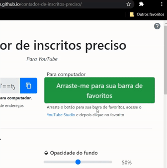

# Contador de inscritos preciso
_Instruções_

> _**Obs.:**_ Por este contador, só é possível verificar o número de inscritos **do seu próprio canal**. Caso queira verificar a de qualquer canal, utilize o meu [outro contador de inscritos](https://josejefferson.github.io/contador-de-inscritos/), mas sem precisão na contagem.

## No computador

_**Passo 1:**_
Primeiro personalize o contador de inscritos como quiser, mudando as cores, tamanhos, margens e fontes. Você pode ver uma prévia no final da página

_**Passo 2:**_
Arraste este botão para sua barra de favoritos

> Caso não esteja vendo sua barra de favoritos pressione <kbd>Ctrl</kbd> + <kbd>Shift</kbd> + <kbd>B</kbd>

_**Passo 3:**_
Acesse o [YouTube Studio](https://studio.google.com) logado na sua conta do YouTube

_**Passo 4:**_
Quando o carregamento da página do YouTube Studio terminar clique em _"Iniciar contador de inscritos"_ na sua barra de favoritos

Aguarde o carregamento e seu contador será exibido.

> **Dicas:**  
> Clique duas vezes em qualquer lugar para entrar em tela cheia. Clique com o botão direito para esconder o ponteiro do mouse

## No celular

_**Passo 1:**_
Primeiro personalize o contador de inscritos como quiser, mudando as cores, tamanhos, margens e fontes. Você pode ver uma prévia no final da página

_**Passo 2:**_
Copie o código gerado clicando no botão _Copiar_

_**Passo 3:**_
Acesse o [YouTube Studio](https://studio.youtube.com/?approve_browser_access=1) no seu celular

- Caso apareça isto, clique em **Continuar para o Studio**

_**Passo 4:**_
Quando o carregamento da página do YouTube Studio terminar, cole o código na barra de endereços do navegador

> **IMPORTANTE:** Verifique se o início do código (a parte que contém `javascript:`) foi colado, pois caso contrário o código não irá funcionar. Caso não tenha colado, digite `javascript:` manualmente no início do código

_**Passo 5:**_
Clique para executar o código

Aguarde o carregamento e seu contador será exibido.

> **Dica:**  
> Toque duas vezes em qualquer lugar para entrar em tela cheia

## Retornar ao YouTube Studio

Para retornar ao Studio simplesmente atualize a página